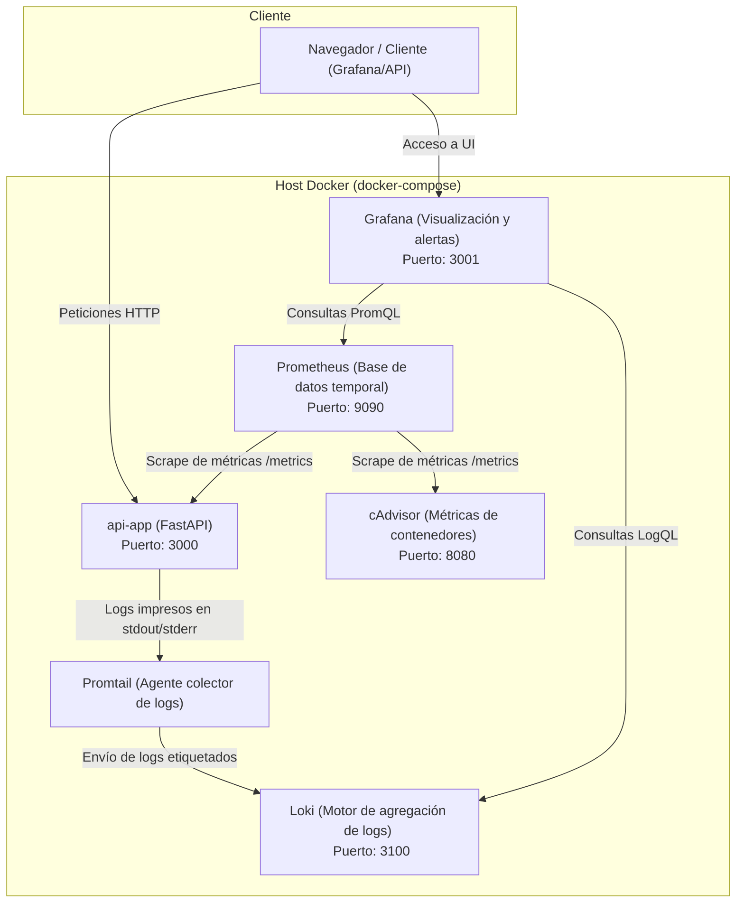

# Plan de Formación: Taller de Observabilidad (3 Sesiones de 1 Hora)

Este documento define la estructura, contenidos y dinámicas para impartir un taller práctico de observabilidad de **3 horas, distribuidas en 3 días (1 hora por sesión)**, utilizando el entorno proporcionado en el repositorio [taller-observabilidad](file:///Users/ics/Repos/icasadosar/taller-observabilidad).

---

## 📋 Resumen del Taller

* **Estructura:** 3 sesiones de 60 minutos (total 3 horas).
* **Nivel:** Principiante / Intermedio.
* **Audiencia:** Ingenieros de Software, DevOps, SREs o Administradores de Sistemas interesados en entender cómo monitorizar y diagnosticar aplicaciones en producción.
* **Prerrequisitos para los alumnos:**
  * Docker y Docker Compose instalados.
  * Git instalado.
  * Conocimientos básicos de terminal/línea de comandos.
  * Nociones básicas de protocolo HTTP y Python/FastAPI (útil pero no imprescindible).

---

## 🗺️ Arquitectura del Entorno

El taller despliega un conjunto de contenedores conectados en red para ilustrar la recolección de métricas y la centralización de logs:

---

## 📅 Planificación General por Sesiones

| Sesión | Duración | Temática Principal | Actividades Teórico-Prácticas |
| :--- | :---: | :--- | :--- |
| **Día 1: Introducción y Métricas** | 60 min | Introducción a la observabilidad, despliegue del entorno y Prometheus. | 25 min Teoría / 35 min Práctica |
| **Día 2: Agregación de Logs** | 60 min | Centralización de logs de contenedores con Loki y Promtail. | 25 min Teoría / 35 min Práctica |
| **Día 3: Visualización e Incidente** | 60 min | Aprovisionamiento en Grafana, Dashboards y Simulación de Incidente. | 15 min Teoría / 45 min Práctica |

---

## 📚 Estructura Detallada por Sesión

### 🏁 Día 1: Introducción a la Observabilidad y Métricas con Prometheus (60 min)

* **Objetivo:** Entender la filosofía de la observabilidad, desplegar el entorno en local e interactuar con métricas e instrumentación mediante consultas PromQL.

#### 1.1 Contenido Teórico (25 min)
* **Monitoreo vs. Observabilidad:**
  * **Monitoreo (Reactivo):** Nos avisa cuando algo está fallando basándose en reglas predefinidas y umbrales rígidos (*"el disco está al 90%"*). Resuelve los "conocidos conocidos".
  * **Observabilidad (Proactivo):** Permite explorar el comportamiento del sistema mediante la telemetría para entender **por qué** está fallando algo desconocido o nuevo (*"desconocidos desconocidos"*).
* **Los Pilares de la Observabilidad (M.E.L.T.):** Métricas (valores numéricos agregados), Logs (eventos textuales fechados) y Trazas (recorrido distribuido de una petición).
* **Modelo Pull de Prometheus:** Por qué Prometheus inicia la recolección conectándose vía HTTP a los procesos (scraping) y cómo esto desacopla y protege a la aplicación de caídas en el sistema de telemetría.
* **Tipos de Métricas en Prometheus:**
  * **Counter (Contador):** Solo se incrementa (ej. peticiones totales). Se analiza con `rate()` o `increase()`.
  * **Gauge (Indicador):** Sube y baja arbitrariamente (ej. uso de memoria, conexiones simultáneas).
  * **Histogram (Histograma):** Agrupa observaciones en rangos configurables (buckets) permitiendo el cálculo de percentiles con `histogram_quantile()`.
  * **Summary (Resumen):** Calcula cuantiles en el cliente; no permite agregaciones multidimensionales.
* **Fundamentos de PromQL:** Sintaxis declarativa, filtros por etiquetas, rangos de tiempo e interpolación de tasas.

#### 1.2 Práctica Guiada (35 min)
1. **Despliegue inicial (10 min):**
   * Clonar el repositorio y analizar el archivo [docker-compose.yml](file:///Users/ics/Repos/icasadosar/taller-observabilidad/docker-compose.yml).
   * Levantar el entorno local: `docker compose up -d`.
   * Verificar la disponibilidad de la API (puerto 3000), Prometheus (9090), Grafana (3001) y cAdvisor (8080).
2. **Inspección de Instrumentación (10 min):**
   * Revisar [main.py](file:///Users/ics/Repos/icasadosar/taller-observabilidad/main.py) y ver cómo se inicializa `prometheus_fastapi_instrumentator`.
   * Visitar `http://localhost:3000/metrics` para analizar el formato estándar de OpenMetrics expuesto.
3. **Ejercicios en la Consola de Prometheus (15 min):**
   * Acceder a `http://localhost:9090`.
   * Consultar la tasa de peticiones por segundo: `rate(http_requests_total[1m])`.
   * Consultar el uso de CPU de contenedores medido por cAdvisor: `sum(rate(container_cpu_usage_seconds_total{container="api-app"}[1m])) * 100`.

---

### 🪵 Día 2: Agregación de Logs con Loki y Promtail (60 min)

* **Objetivo:** Comprender cómo se gestionan centralizadamente los registros en arquitecturas de microservicios y aprender a localizarlos y filtrarlos con LogQL.

#### 2.1 Contenido Teórico (25 min)
* **El Desafío de los Logs en Contenedores:** Los contenedores son efímeros y escalables. Los logs locales en archivos del disco desaparecen al reiniciarse el contenedor, y es inviable entrar a cada máquina vía SSH en entornos con réplicas.
* **Filosofía de Grafana Loki (Indexación Inteligente):**
  * A diferencia de sistemas pesados como Elasticsearch (que indexan el texto completo de cada línea), Loki **solo indexa las etiquetas** de los metadatos (ej. `{container="api-app", environment="prod"}`).
  * Esto reduce los requisitos de hardware drásticamente (menor uso de RAM y almacenamiento) y mantiene la velocidad de búsqueda óptima para desarrollo y operaciones.
* **El Rol de Promtail:**
  * Lee los archivos JSON que genera Docker para cada contenedor en `/var/lib/docker/containers/`.
  * Se comunica con el socket de Docker (`/var/run/docker.sock`) para recuperar metadatos dinámicos.
  * Etiqueta las líneas y las envía a Loki en lotes comprimidos.
* **Sintaxis de LogQL (Loki Query Language):**
  * Selectores de streams: `{container="api-app"}`.
  * Filtros textuales: `|= "ERROR"`, `!= "DEBUG"`, o expresiones regulares.
  * Conversión de logs a métricas: `count_over_time({container="api-app"} |= "ERROR" [5m])`.

#### 2.2 Práctica Guiada (35 min)
1. **Inspección de Configuración (10 min):**
   * Analizar [promtail-config.yml](file:///Users/ics/Repos/icasadosar/taller-observabilidad/promtail-config.yml) para entender la configuración de scraping de docker y el relabeling.
2. **Generación de Incidentes Controlados (10 min):**
   * Provocar errores explícitos llamando al endpoint `/api/v1/error` mediante `curl http://localhost:3000/api/v1/error` para escribir trazas críticas en los logs del contenedor.
3. **Exploración de Logs en Grafana (15 min):**
   * Abrir Grafana en `http://localhost:3001` (Credenciales: admin/admin).
   * Ir al apartado **Explore** y seleccionar el Datasource **Loki**.
   * Realizar búsquedas de streams filtrando logs del contenedor de la API: `{container="api-app"} |= "ERROR"`.
   * Realizar una métrica temporal a partir de los logs para comprobar la frecuencia de los fallos.

---

### 📊 Día 3: Visualización con Grafana y Caso de Diagnóstico Real (60 min)

* **Objetivo:** Unificar métricas y logs en paneles interactivos e implementar un método sistemático para resolver problemas simulados en tiempo real.

#### 3.1 Contenido Teórico (15 min)
* **Dashboard-as-Code (Grafana Provisioning):** Ventajas de versionar dashboards en JSON y aprovisionarlos mediante `dashboard_provider.yml`, evitando la configuración manual propensa a pérdidas.
* **Las 4 Señales de Oro de SRE (Google):**
  1. **Latencia:** Tiempo de respuesta de las peticiones (monitoreando percentiles altos como P95/P99).
  2. **Tráfico:** Demanda sobre el sistema (peticiones/segundo).
  3. **Errores:** Tasa de fallos explícitos e implícitos.
  4. **Saturación:** Qué tan saturados están los recursos del host/contenedor (CPU, memoria, colas).
* **El Flujo de Diagnóstico Sistemático:**
  1. **Detección:** Panel de Grafana (ej. "La latencia P95 subió a 400ms").
  2. **Aislamiento:** Filtrar recursos en Prometheus/cAdvisor (ej. CPU del contenedor limitada/throttled).
  3. **Causa Raíz:** Consultar logs del contenedor afectado en Loki para ver el stack trace del error.

#### 3.2 Práctica Guiada y Reto (45 min)
1. **Configuración de Datasources e Importación (10 min):**
   * Configurar los Datasources de Prometheus y Loki en la interfaz de Grafana.
   * Inspeccionar el dashboard aprovisionado para el monitoreo de recursos del contenedor en [docker_monitor.json](file:///Users/ics/Repos/icasadosar/taller-observabilidad/grafana/provisioning/dashboards/docker_monitor.json).
2. **Construcción del Dashboard personalizado (20 min):**
   * Diseñar un dashboard unificado para FastAPI con:
     * Gráfico de Tráfico (peticiones por segundo).
     * Indicador (Stat) de la tasa de errores HTTP 500.
     * Gráfico de latencia (Percentil 95 de duración).
     * Panel de logs de Loki filtrados por contenedor en tiempo real.
3. **Desafío Final: Resolución de Incidente Real (15 min):**
   * **El Reto:** El profesor simulará un incidente de carga y fallas en vivo (p. ej., ejecutando peticiones concurrentes masivas a `/api/v1/data` con latencias simuladas y errores en `/api/v1/error`).
   * **Misión del alumno:** Utilizar el dashboard creado y la pestaña Explore para diagnosticar y responder tres preguntas clave:
     1. ¿A cuántas peticiones por segundo (RPS) se somete el sistema?
     2. ¿Cuál es el error textual reportado por Loki?
     3. ¿Qué porcentaje de peticiones están fallando?
   * Cierre del taller y conclusiones.
